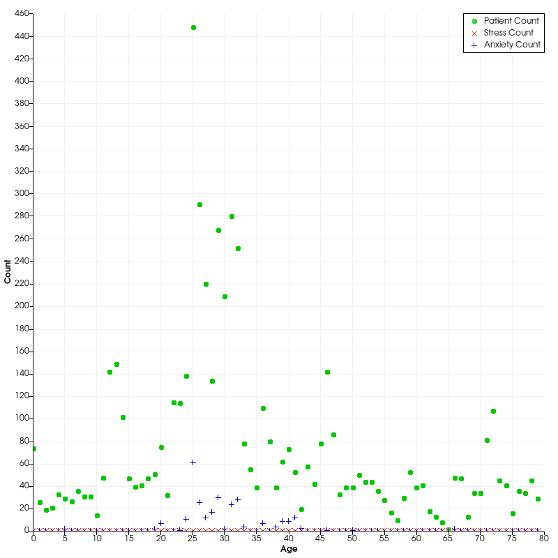

# CSE 5544 Assignment 1

For the first assignment, we were asked to review two visualization tools.
Having worked with WebGL in the past, that was my first choice. I also decided
to explore VTK. You can find both of those reviews in the docs folder.

As for the second portion of the assignment, we were asked to use two tools
to create a couple visualizations. The remainder of this document covers that
portion of the assignment.

## Visualizations

In this section, I'll share and explain my four visualizations.

### VTK

As far as VTK is concerned, I used the Python library to generate my screenshots.

#### Counts vs. Age Scatter Plot

The following visualizations is a plot of incident counts versus age. 

When I was first looking at the healthcare data, I struggled a lot with finding ways
to visualize it. After all, a large portion of the data is categorical (Demographics, 
Injury Info, Encounter Info, etc.), so it was tough to work with in VTK. 

After fiddling with the scatter plot in VTK for awhile (as seen in the assets folder), 
I thought it might be cool to look at patient ages and corresponding incidents.
For instance, I asked myself the following questions:

1. Does age influence incident reports (Anxiety, Vision, Stess, etc.)?
2. How can we visualize that?

Using my experience with the scatter plot, I thought it might be interesting
to then bin patients by age to see if I could find any trends in the data.
Right away we can sew there's a larger curve trending toward age 25 from
both sides. I'm not sure why, but for whatever reason it seems this
clinical data is skewed toward people in their 20s.

Of course, the assignment said this type of graph would be boring on its own,
so I decided to take my analysis a step further. After scanning through the data set,
the only other quantitative data set I could find were the incidents (aka diagnosis flags).

At that point, I figured it would be interesting to see if we could spot any trends
between the incidents and the patient ages. As a result, I decided to bin a few of
the incidents by count and plot them right over top of the age counts plot. 

Unfortunately, what I found was not all that interesting. As the number of patients
per age bracket went up, so do the incidents. In fact, they appear to be almost
directly proportional. No age had an frightening upticks in incidents.

#### 

## Favorite Image

Of the four visualizations above, my favorite visualization is:

## Features

In this section, I'll be covering the two best and one worst feature of
the two tools I used: VTK and D3.

### VTK

VTK, or the Visualization Toolkit, is a visualization platform that has API
support in a handful of popular languages like Python, Java, and C++. In the
following sections, I'll cover the two best features and the worst feature.

#### Best Two Features

#### Worst Feature

By far, the **worst** feature of VTK is installation. As a PC user, I had to go
through an incredibly lengthy installation process just to start rendering
visualizations.

According to the official documentation, installing VTK is a 7-step process:

1. Download VTK
2. Download CMake
3. Create a Build Folder
4. Run CMake
5. Open the Visual Studio Project
6. Install the Project
7. Manual Building

In total, I spent about a day and a half getting all this together. After all,
the CMake build and the Visual Studio build both take over an hour. And,
if you're like me, you don't have Visual Studio or CMake, so downloading and
installing those tools takes some time.

In addition, the directions include some implicit instructions on how to run
CMake and Visual Studio, so I had to spend some time learning the ropes there
as well.

After fighting with all that, I had to install Conda to install the Python VTK
package. I'm not sure if there's an easier way to do all this, but there are
certainly no tutorials to help.

*Fun Fact*: In the time it took me to write this section, the Visual Studio build
was only 25% complete.

### D3
